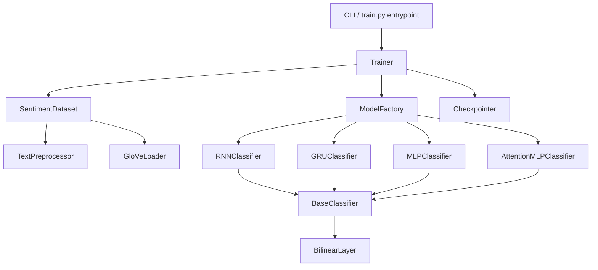
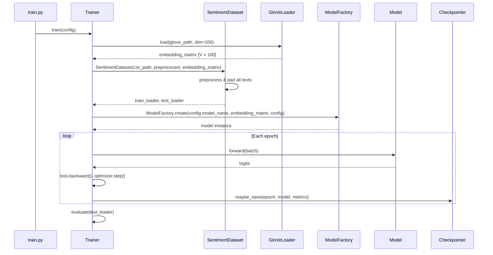
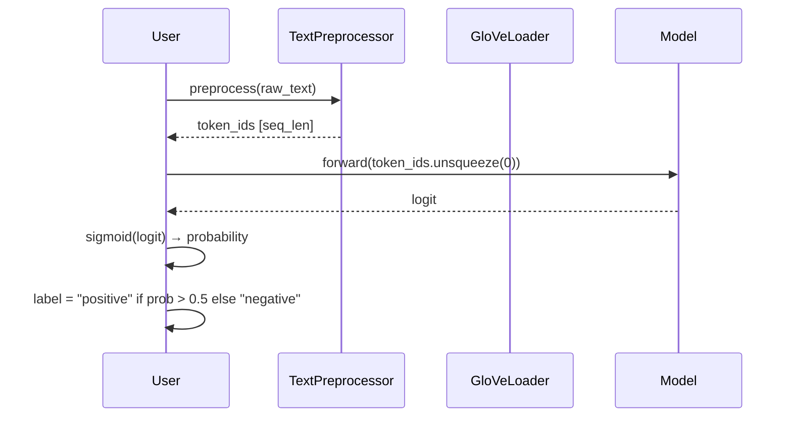

# Design Document: Text Sentiment Classifier

## Overview

A clean, portfolio-quality binary sentiment classifier (positive/negative) trained on IMDB movie reviews.
The project uses PyTorch with GloVe word embeddings and supports multiple swappable model architectures —
RNN, GRU, a token-wise MLP, and an MLP with restricted self-attention — all behind a shared interface.

The codebase is structured as a proper Python package: clear module boundaries, no God-objects, and
extension points that let a future developer add a new architecture, swap the dataset, or change the
embedding source with minimal friction. The goal is code a hiring manager can read in ten minutes and
understand completely.

---

## Architecture



**Package layout**:

```
text_sentiment_classifier/
├── data/
│   ├── __init__.py
│   ├── dataset.py          # SentimentDataset
│   ├── preprocessor.py     # TextPreprocessor
│   └── embeddings.py       # GloVeLoader
├── models/
│   ├── __init__.py
│   ├── base.py             # BaseClassifier (abstract)
│   ├── layers.py           # BilinearLayer, RestrictedAttention
│   ├── rnn.py              # RNNClassifier
│   ├── gru.py              # GRUClassifier
│   ├── mlp.py              # MLPClassifier
│   └── attention_mlp.py    # AttentionMLPClassifier
├── training/
│   ├── __init__.py
│   ├── trainer.py          # Trainer
│   └── checkpointer.py     # Checkpointer
├── utils/
│   ├── __init__.py
│   └── metrics.py          # accuracy, confusion matrix helpers
├── config.py               # dataclass-based hyperparameter config
├── factory.py              # ModelFactory
└── train.py                # CLI entrypoint
```

---

## Sequence Diagrams

### Training Flow



### Inference Flow



---

## Components and Interfaces

### TextPreprocessor

**Purpose**: Converts raw review strings into padded integer token sequences.

**Interface**:
```python
class TextPreprocessor:
    def __init__(self, max_len: int, vocab: dict[str, int]) -> None: ...
    def clean(self, text: str) -> str: ...          # lowercase + strip non-alpha
    def tokenize(self, text: str) -> list[str]: ... # split on whitespace
    def encode(self, text: str) -> list[int]: ...   # tokens → ids, UNK=0
    def pad(self, ids: list[int]) -> list[int]: ... # truncate or zero-pad to max_len
    def process(self, text: str) -> list[int]: ...  # clean → tokenize → encode → pad
```

**Responsibilities**:
- Text normalization (lowercase, remove non-alphabetic characters via regex)
- Vocabulary lookup with a dedicated unknown-token fallback
- Fixed-length sequence production for batch collation

---

### GloVeLoader

**Purpose**: Reads a GloVe `.txt` file and produces a vocabulary + embedding matrix.

**Interface**:
```python
class GloVeLoader:
    def load(
        self, path: str, dim: int = 100
    ) -> tuple[dict[str, int], torch.Tensor]:
        """
        Returns (vocab, embedding_matrix).
        vocab: word → index (index 0 reserved for <PAD>)
        embedding_matrix: shape [vocab_size, dim]
        """
        ...
```

**Responsibilities**:
- Parse GloVe file line-by-line
- Reserve index 0 for the `<PAD>` token (zero vector)
- Return a float32 tensor suitable for `nn.Embedding.from_pretrained`

---

### SentimentDataset

**Purpose**: PyTorch `Dataset` wrapping the IMDB CSV.

**Interface**:
```python
class SentimentDataset(torch.utils.data.Dataset):
    def __init__(
        self,
        csv_path: str,
        preprocessor: TextPreprocessor,
        split: Literal["train", "test"],
    ) -> None: ...

    def __len__(self) -> int: ...
    def __getitem__(self, idx: int) -> tuple[torch.Tensor, torch.Tensor]:
        """Returns (token_ids [max_len], label [1])"""
        ...
```

**Responsibilities**:
- Load CSV, filter by `split` column
- Apply `TextPreprocessor.process` to each review
- Return tensors compatible with `DataLoader`

---

### BaseClassifier

**Purpose**: Abstract base that enforces the shared forward contract.

**Interface**:
```python
class BaseClassifier(nn.Module, ABC):
    def __init__(self, embedding_matrix: torch.Tensor, config: ModelConfig) -> None: ...

    @abstractmethod
    def forward(self, x: torch.Tensor) -> torch.Tensor:
        """x: [batch, seq_len] → returns logits [batch, 1]"""
        ...
```

**Responsibilities**:
- Load pretrained embeddings via `nn.Embedding.from_pretrained`
- Optionally freeze embeddings based on `config.freeze_embeddings`
- Provide a common `predict_proba` convenience method

---

### ModelFactory

**Purpose**: Maps a string model name to a concrete classifier instance.

**Interface**:
```python
class ModelFactory:
    _registry: dict[str, type[BaseClassifier]] = {}

    @classmethod
    def register(cls, name: str) -> Callable:
        """Decorator to register a new model class."""
        ...

    @classmethod
    def create(
        cls,
        name: str,
        embedding_matrix: torch.Tensor,
        config: ModelConfig,
    ) -> BaseClassifier:
        """Raises ValueError if name is not registered."""
        ...
```

**Responsibilities**:
- Decouple training code from concrete model classes
- Allow new architectures to self-register via `@ModelFactory.register("my_model")`

---

### Trainer

**Purpose**: Owns the training loop, evaluation, and orchestration.

**Interface**:
```python
class Trainer:
    def __init__(self, config: TrainingConfig, device: torch.device) -> None: ...

    def fit(
        self,
        model: BaseClassifier,
        train_loader: DataLoader,
        test_loader: DataLoader,
    ) -> TrainingResult: ...

    def evaluate(
        self, model: BaseClassifier, loader: DataLoader
    ) -> EvalResult: ...
```

**Responsibilities**:
- Run epochs with BCE loss and configurable optimizer (Adam default)
- Call `Checkpointer.maybe_save` after each evaluation
- Return a `TrainingResult` with per-epoch loss/accuracy history

---

### Checkpointer

**Purpose**: Saves model weights when validation accuracy improves.

**Interface**:
```python
class Checkpointer:
    def __init__(self, save_dir: str, model_name: str) -> None: ...

    def maybe_save(
        self, epoch: int, model: BaseClassifier, metrics: EvalResult
    ) -> bool:
        """Saves if metrics.accuracy > best seen so far. Returns True if saved."""
        ...

    def load_best(self, model: BaseClassifier) -> BaseClassifier: ...
```

---

## Data Models

### TrainingConfig

```python
@dataclass
class TrainingConfig:
    # Data
    csv_path: str
    glove_path: str
    max_len: int = 200
    batch_size: int = 32

    # Training
    epochs: int = 10
    lr: float = 1e-3
    eval_every: int = 1          # evaluate on test set every N epochs

    # Model
    model_name: str = "gru"      # one of: rnn, gru, mlp, attention_mlp
    hidden_dim: int = 128
    freeze_embeddings: bool = True
    dropout: float = 0.3

    # I/O
    checkpoint_dir: str = "checkpoints/"
    device: str = "cuda" if torch.cuda.is_available() else "cpu"
```

**Validation rules**:
- `max_len` > 0
- `batch_size` > 0
- `lr` ∈ (0, 1)
- `model_name` must be a key in `ModelFactory._registry`
- `glove_path` must point to a readable file

---

### EvalResult

```python
@dataclass
class EvalResult:
    accuracy: float          # ∈ [0, 1]
    loss: float
    tp: int
    tn: int
    fp: int
    fn: int

    @property
    def precision(self) -> float: ...
    @property
    def recall(self) -> float: ...
    @property
    def f1(self) -> float: ...
```

---

### TrainingResult

```python
@dataclass
class TrainingResult:
    train_losses: list[float]
    eval_results: list[EvalResult]   # one per eval_every epoch
    best_accuracy: float
    best_epoch: int
```

---

## Algorithmic Pseudocode

### Main Training Algorithm

```python
def fit(self, model, train_loader, test_loader) -> TrainingResult:
    """
    Preconditions:
      - model is a valid BaseClassifier on self.device
      - train_loader and test_loader are non-empty DataLoaders
      - self.config.epochs > 0

    Postconditions:
      - Returns TrainingResult with len(train_losses) == config.epochs
      - model weights reflect the final training epoch (not necessarily best)
      - Checkpointer has saved the best-accuracy checkpoint

    Loop invariant (per epoch):
      - All batches in train_loader have been consumed exactly once
      - optimizer state is consistent with accumulated gradients
    """
    optimizer = Adam(model.parameters(), lr=config.lr)
    criterion = BCEWithLogitsLoss()
    train_losses = []
    eval_results = []

    for epoch in range(config.epochs):
        model.train()
        epoch_loss = 0.0

        for batch_ids, batch_labels in train_loader:
            # Loop invariant: optimizer.zero_grad() has been called
            # before this batch's backward pass
            optimizer.zero_grad()
            logits = model(batch_ids.to(device))           # [B, 1]
            loss = criterion(logits, batch_labels.float())
            loss.backward()
            optimizer.step()
            epoch_loss += loss.item()

        train_losses.append(epoch_loss / len(train_loader))

        if epoch % config.eval_every == 0:
            result = self.evaluate(model, test_loader)
            eval_results.append(result)
            checkpointer.maybe_save(epoch, model, result)

    return TrainingResult(train_losses, eval_results, ...)
```

**Preconditions**:
- `model` has been moved to the correct device before calling `fit`
- `train_loader` produces `(token_ids: LongTensor[B, L], labels: LongTensor[B, 1])` pairs

**Postconditions**:
- `len(result.train_losses) == config.epochs`
- `result.best_accuracy` equals the highest `EvalResult.accuracy` seen

**Loop invariant**:
- After each `optimizer.step()`, model parameters reflect gradients from the current batch only

---

### GloVe Loading Algorithm

```python
def load(self, path: str, dim: int = 100) -> tuple[dict[str, int], torch.Tensor]:
    """
    Preconditions:
      - path points to a valid GloVe text file
      - dim matches the actual vector dimension in the file

    Postconditions:
      - vocab["<PAD>"] == 0
      - embedding_matrix[0] is the zero vector (PAD)
      - len(vocab) == embedding_matrix.shape[0]
      - embedding_matrix.dtype == torch.float32

    Loop invariant:
      - After processing line i, len(vocab) == i + 2 (PAD + i words)
    """
    vocab = {"<PAD>": 0}
    vectors = [torch.zeros(dim)]   # index 0 = PAD

    with open(path, encoding="utf-8") as f:
        for line in f:
            parts = line.split()
            word = parts[0]
            vector = torch.tensor([float(x) for x in parts[1:]], dtype=torch.float32)

            if vector.shape[0] != dim:
                continue   # skip malformed lines

            vocab[word] = len(vocab)
            vectors.append(vector)

    embedding_matrix = torch.stack(vectors)   # [V, dim]
    return vocab, embedding_matrix
```

---

### Text Preprocessing Algorithm

```python
def process(self, text: str) -> list[int]:
    """
    Preconditions:
      - text is a non-None string (may be empty)
      - self.vocab is populated
      - self.max_len > 0

    Postconditions:
      - Returns a list of exactly self.max_len integers
      - All values are valid vocab indices or 0 (PAD/UNK)
      - len(result) == self.max_len

    No loop invariant needed (single-pass pipeline)
    """
    cleaned = re.sub(r"[^a-zA-Z\s]", "", text.lower())
    tokens  = cleaned.split()
    ids     = [self.vocab.get(tok, 0) for tok in tokens]

    # Truncate
    ids = ids[:self.max_len]

    # Pad with zeros
    ids = ids + [0] * (self.max_len - len(ids))

    assert len(ids) == self.max_len
    return ids
```

---

## Key Functions with Formal Specifications

### RNNClassifier.forward

```python
class RNNClassifier(BaseClassifier):
    def __init__(self, embedding_matrix: torch.Tensor, config: ModelConfig) -> None:
        super().__init__(embedding_matrix, config)
        self.rnn = nn.RNN(
            input_size=embedding_matrix.shape[1],
            hidden_size=config.hidden_dim,
            batch_first=True,
        )
        self.dropout = nn.Dropout(config.dropout)
        self.head = nn.Linear(config.hidden_dim, 1)

    def forward(self, x: torch.Tensor) -> torch.Tensor:
        """
        x: LongTensor [batch, seq_len]
        returns: FloatTensor [batch, 1]  (raw logits)

        Preconditions:
          - x.dtype == torch.long
          - x.shape[1] == config.max_len
          - All values in x are valid embedding indices

        Postconditions:
          - output.shape == (x.shape[0], 1)
          - output is differentiable w.r.t. model parameters
        """
        embedded = self.embedding(x)          # [B, L, E]
        _, hidden = self.rnn(embedded)        # hidden: [1, B, H]
        hidden = self.dropout(hidden.squeeze(0))  # [B, H]
        return self.head(hidden)              # [B, 1]
```

---

### AttentionMLPClassifier.forward

```python
class AttentionMLPClassifier(BaseClassifier):
    """
    Token-wise MLP followed by restricted self-attention pooling.
    Each token attends only to its k nearest neighbours (window-based).
    """
    def __init__(self, embedding_matrix: torch.Tensor, config: ModelConfig) -> None:
        super().__init__(embedding_matrix, config)
        E = embedding_matrix.shape[1]
        self.token_mlp = nn.Sequential(
            nn.Linear(E, config.hidden_dim),
            nn.ReLU(),
            nn.Dropout(config.dropout),
        )
        self.attention = RestrictedAttention(config.hidden_dim, window=config.attn_window)
        self.head = nn.Linear(config.hidden_dim, 1)

    def forward(self, x: torch.Tensor) -> torch.Tensor:
        """
        Preconditions:
          - x: LongTensor [B, L]
          - config.attn_window > 0 and <= L

        Postconditions:
          - output.shape == (B, 1)
          - Attention weights sum to 1 along the sequence dimension
        """
        embedded  = self.embedding(x)           # [B, L, E]
        hidden    = self.token_mlp(embedded)    # [B, L, H]
        context   = self.attention(hidden)      # [B, H]  (weighted mean)
        return self.head(context)               # [B, 1]
```

---

### BilinearLayer

```python
class BilinearLayer(nn.Module):
    """
    Applies a learned bilinear transformation: output = x @ W @ y^T
    Used for flexible tensor contraction in attention variants.
    """
    def __init__(self, in_features: int, out_features: int) -> None: ...

    def forward(self, x: torch.Tensor, y: torch.Tensor) -> torch.Tensor:
        """
        Preconditions:
          - x.shape[-1] == self.in_features
          - y.shape[-1] == self.in_features

        Postconditions:
          - output.shape[-1] == self.out_features
          - output is differentiable w.r.t. self.weight
        """
        ...
```

---

## Example Usage

```python
from text_sentiment_classifier.config import TrainingConfig
from text_sentiment_classifier.data.embeddings import GloVeLoader
from text_sentiment_classifier.data.preprocessor import TextPreprocessor
from text_sentiment_classifier.data.dataset import SentimentDataset
from text_sentiment_classifier.factory import ModelFactory
from text_sentiment_classifier.training.trainer import Trainer
from torch.utils.data import DataLoader

# 1. Load embeddings
vocab, embedding_matrix = GloVeLoader().load("glove.6B.100d.txt", dim=100)

# 2. Build datasets
preprocessor = TextPreprocessor(max_len=200, vocab=vocab)
train_ds = SentimentDataset("imdb.csv", preprocessor, split="train")
test_ds  = SentimentDataset("imdb.csv", preprocessor, split="test")
train_loader = DataLoader(train_ds, batch_size=32, shuffle=True)
test_loader  = DataLoader(test_ds,  batch_size=64, shuffle=False)

# 3. Create model
config = TrainingConfig(model_name="gru", hidden_dim=128, epochs=10)
model  = ModelFactory.create(config.model_name, embedding_matrix, config)

# 4. Train
import torch
trainer = Trainer(config, device=torch.device(config.device))
result  = trainer.fit(model, train_loader, test_loader)

print(f"Best accuracy: {result.best_accuracy:.4f} at epoch {result.best_epoch}")

# 5. Single inference
raw = "This movie was absolutely fantastic — great performances all around."
ids = preprocessor.process(raw)
x   = torch.tensor(ids).unsqueeze(0)
prob = torch.sigmoid(model(x)).item()
label = "positive" if prob > 0.5 else "negative"
print(f"{label} ({prob:.2%})")
```

---

## Correctness Properties

### Property 1: Preprocessor output length is always exactly max_len

```python
assert all(len(preprocessor.process(text)) == preprocessor.max_len
           for text in sample_texts)
```

### Property 2: GloVe PAD token is always index 0 with a zero vector

```python
vocab, emb = GloVeLoader().load(glove_path)
assert vocab["<PAD>"] == 0
assert torch.all(emb[0] == 0)
```

### Property 3: Model output shape matches batch size

```python
for batch_ids, _ in train_loader:
    logits = model(batch_ids)
    assert logits.shape == (batch_ids.shape[0], 1)
    break
```

### Property 4: All registered model names produce valid instances

```python
for name in ModelFactory._registry:
    m = ModelFactory.create(name, embedding_matrix, config)
    assert isinstance(m, BaseClassifier)
```

### Property 5: Checkpointer only saves when accuracy strictly improves

```python
results = [EvalResult(accuracy=0.70, ...), EvalResult(accuracy=0.65, ...)]
saves   = [checkpointer.maybe_save(i, model, r) for i, r in enumerate(results)]
assert saves == [True, False]
```

### Property 6: Training loss is non-negative for all epochs

```python
assert all(loss >= 0 for loss in result.train_losses)
```

### Property 7: Attention weights sum to 1

```python
attn_weights = model.attention.last_weights   # exposed for testing
assert torch.allclose(attn_weights.sum(dim=-1), torch.ones(attn_weights.shape[0]))
```

---

## Error Handling

### Missing or Malformed GloVe File

**Condition**: `glove_path` does not exist, is unreadable, or contains lines with the wrong vector dimension.

**Response**: Raise `FileNotFoundError` with a descriptive message before any embedding matrix is allocated. Malformed individual lines are silently skipped with a warning log entry.

**Recovery**: The CLI exits with a non-zero code and prints the expected file format.

---

### Unknown Vocabulary Token

**Condition**: A word in a review is not present in the GloVe vocabulary.

**Response**: `TextPreprocessor.encode` maps it to index 0 (`<PAD>`), which has a zero embedding vector. No exception is raised.

**Recovery**: Graceful degradation — the model still runs, but that token contributes zero signal.

---

### Unknown Model Name

**Condition**: `config.model_name` is not registered in `ModelFactory`.

**Response**: `ModelFactory.create` raises `ValueError: Unknown model '{name}'. Available: {list(registry.keys())}`.

**Recovery**: The CLI catches this and exits cleanly with the list of valid options.

---

### CUDA Out of Memory

**Condition**: Batch size is too large for the available GPU memory.

**Response**: PyTorch raises `torch.cuda.OutOfMemoryError`.

**Recovery**: Trainer catches this, logs a suggestion to reduce `batch_size`, and re-raises. No checkpoint corruption occurs because `optimizer.step()` has not been called for the failing batch.

---

## Testing Strategy

### Unit Testing Approach

Each module is tested in isolation with small, deterministic fixtures.

Key unit tests:
- `TextPreprocessor.process` always returns a list of exactly `max_len` ints
- `TextPreprocessor.clean` strips numbers, punctuation, and normalises case
- `GloVeLoader.load` produces a matrix with the correct shape and a zero row at index 0
- `ModelFactory.create` raises `ValueError` for unregistered names
- `Checkpointer.maybe_save` returns `True` only on strict accuracy improvement

---

### Property-Based Testing Approach

**Property Test Library**: `hypothesis`

Properties to test:

| Property | Generator |
|---|---|
| `len(preprocessor.process(text)) == max_len` for any string | `st.text()` |
| Model forward output shape is `(batch, 1)` for any valid batch size | `st.integers(1, 64)` |
| `GloVeLoader` embedding matrix row count equals vocab size | random vocab files |
| Checkpointer save decision is monotone in accuracy | `st.floats(0, 1)` sequences |

---

### Integration Testing Approach

- Train for 1 epoch on a 200-sample subset and assert `EvalResult.accuracy > 0.5`
- Verify that a saved checkpoint can be reloaded and produces identical logits
- Verify that swapping `model_name` from `"rnn"` to `"gru"` in config produces a different model class but the same training loop behaviour

---

## Performance Considerations

- GloVe loading is a one-time cost at startup; the resulting tensor is shared across train/test datasets via a reference — no duplication.
- Embeddings are frozen by default (`freeze_embeddings=True`), which reduces backward-pass memory and speeds up training by ~20% at the cost of not adapting embeddings to the domain.
- `max_len=200` is a practical cap; reviews longer than 200 tokens are truncated (most IMDB reviews fall under this limit).
- DataLoader `num_workers` should be set to 2–4 on multi-core machines; the default of 0 will bottleneck GPU training.

---

## Security Considerations

This is an offline training project with no network-facing surface. The only security-relevant note is:

- GloVe and CSV files are loaded from local paths. No user-controlled input is evaluated as code (no `eval`, no `pickle.load` on untrusted files).
- If the project is extended to a web API, all raw text inputs must be treated as untrusted and length-capped before tokenisation to prevent unbounded memory allocation.

---

## Dependencies

| Package | Purpose | Pinned Version |
|---|---|---|
| `torch` | Neural network training | `>=2.0.0` |
| `numpy` | Tensor utilities | `>=1.24.0` |
| `pandas` | CSV loading | `>=2.0.0` |
| `hypothesis` | Property-based testing | `>=6.0.0` |
| `pytest` | Test runner | `>=7.0.0` |

GloVe vectors (`glove.6B.100d.txt`) must be downloaded separately from the [Stanford NLP GloVe page](https://nlp.stanford.edu/projects/glove/) and are not included in the repository.
